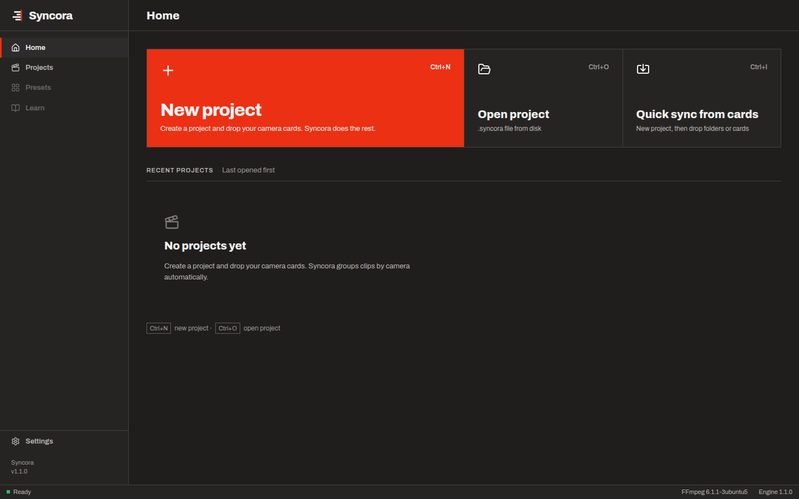

# Syncora — design decisions

This file records how the Syncora interface in `app/` follows the design handoff
(`design_handoff_syncora`, v1.0), which parts are not implemented yet, and each decision taken where the handoff is
silent, conflicting or asks for something the product cannot do yet. Items marked **open** are listed in the
handoff's §26. The code carries a `DESIGN-OPEN: #n` comment wherever one of them applies. The designer has not
confirmed any of these decisions yet.

Screenshots come from the end-to-end suites (`app/e2e`), taken at 1440 × 900 in the dark theme.

| Home (S01) | Analysis (S05), paused |
|---|---|
|  |  |
| **Results (S08)** | **Timeline (S11)** |
|  |  |

## Foundations

| Area | As implemented |
|---|---|
| Tokens | `src/design-system/tokens.css` is `syncora-tokens.css` verbatim. Values the handoff uses but the file lacks are in `tokens-extra.css`, each with its design source. Components use tokens only (no hex). The remaining app styles (`styles.css`) map their old variables onto the tokens. |
| Type | Archivo (bundled `woff2`, SIL OFL: `fonts/OFL.txt`); tabular numerals (`.tnum`) for timecode, offsets, counts and percentages. |
| Shape | Zero radius everywhere; 1 / 2 px borders; no gradients, glass, emoji or shimmer skeletons. |
| Icons | `lucide-react` pinned to 0.460.0 and used by name. The symbol, wordmark and app icons are the supplied SVGs (`assets/`). `.icns` / `.ico` are built from the app-icon masters by `scripts/render-icons.mjs`. |
| Status | Always an icon, a word and a number (for example "REVIEW RECOMMENDED · 72%"). Colour is never the only cue. |
| Review rule | Nothing is locked automatically. Anything below the review threshold (default 85 %, set in Settings → Synchronization) is REVIEW, in amber. |
| Estimates | No time-remaining estimates anywhere: progress shows counts ("3,412 / 4,230 clips") and state words only. |
| Theme | Dark (`data-theme="dark"`). The light token set is present, but there is no theme switch yet. |

## Screens

| Frame | State | Notes |
|---|---|---|
| S00 Splash | not implemented | The window opens on Home; the status bar shows the engine starting. Open item #1 (dark or light splash) remains unresolved. |
| S01 Home | implemented | Recent projects, New / Open project. D-03 covers the sidebar. |
| S02 New project | partial | New project asks where to save the `.syncora` file (native dialog) and opens the import view. The S02 form (name, frame rate, preset) is not built. |
| S03 Media import | implemented | Drop or browse files and folders; live counts per stage while files are found and read. When processing is paused, the progress line says so and offers Resume (media added while paused waits for it). |
| S04 Media browser | implemented | Windowed grid and list for thousands of clips, bins (cameras, groups, review, unmatched, offline, duplicates, failed), search grammar, multi-select and bulk actions. See D-05 and D-06. |
| S05 Analysis | implemented | Stage progress list, source progress and activity. See D-07. |
| S06 Sync workspace | not implemented | Review and manual sync take place in the timeline stage (04) instead: canvas timeline, review queue and inspector (drag, nudge, snap to audio, reject or restore a match, undo / redo). |
| S07 AI sync | not implemented | No AI models ship in this version (D-08). |
| S08 Sync results | implemented | Header, category counts, review callout and a results table grouped by source. See D-07. |
| S09 Transcript, S10 Search | not implemented | The Analyze tab (03) is disabled, with a tooltip that explains why (D-08). |
| S11 Multicam timeline | partial | The existing canvas timeline, restyled with tokens and kept separate from the production index so it stays fast. The track geometry and the marker, AI and transcript lanes of the timeline specification are not implemented. |
| S12 Export | partial | Export is a dialog (format, frame rate, start timecode, handling of uncertain clips) plus a report of what was written. There is no full S12 screen and no export history. |
| S13 Settings | implemented | General, Performance, Synchronization, Storage, About. See D-10. |
| S14 Onboarding | not implemented | |
| S15 Empty states | partial | No projects yet, No media, and *n* clips offline (as a banner). The Timeline before the first sync: no media yet, not synchronised yet (with analysis progress and Sync all), or synchronising (with Show progress). A view that fails to render shows an error card with Try again instead of a blank window. A search with no results shows an empty browser with "0 clips" instead of the S15 card. Transcript, markers and AI empty states need features not in this version. |
| S16 Error states | partial | View errors dialog (per-file reason, Retry failed), offline banner with Relink (Find folder…), error toasts. |

## Decisions

**D-01 Platform.** Electron with React 19 and TypeScript. The handoff allows Electron and names React 18. React 19 is
API-compatible for everything used here and was already the app's version.

**D-02 Top bar and stages.** Stage tabs 01–05 with ⌘1–⌘5 (Ctrl on Windows). A disabled stage has opacity .45 and a
tooltip saying why. The stage action ("Sync", ⇧S) sits on the right, with search (⌘F) and settings (⌘,). The
project-switcher menu is not drawn (**open #10**): the project name is a label, and Home is reached by closing the
project.

**D-03 Home sidebar (open #10).** Projects, Presets and Learn pages are not drawn. Projects opens a project file.
Presets and Learn are disabled, with a tooltip.

**D-04 Large-production rules.** The handoff draws a 46-clip project. At 4,000+ clips the same components are used,
with three changes: lists render only visible rows, counts use thousands separators, and per-clip rows are grouped
by source in the results table.

**D-05 Media list view (open #10).** The list view is not drawn. It reuses the S08 results-table row (chip letter,
name, confidence bar, method, offset, SyncBadge) with the browser's columns.

**D-06 Search.** A single search field with a small grammar, since the handoff does not specify filters for thousands
of clips:

- words, a camera ("Camera A", a letter or a folder name);
- a time range ("08:30 - 10:00");
- a status ("unsynchronized", "review", "offline", "failed", "duplicate");
- a confidence comparison ("confidence < 80%").

Several words match as a phrase or as all words.

**D-07 Analysis stages.** S05 draws Metadata · Audio · Video · AI. Syncora 1.1 runs these stages:

- Metadata: read every file.
- Audio: decode and fingerprint.
- Match: verify candidate pairs.
- Extended search: a slower, wider audio search for clips the first pass could not place.

The fourth row is labelled "Extended search", not "AI", so the screen does not claim analysis that does not happen.
The results table shows "Manual sync required" for clips that no evidence could place.

**D-08 AI features.** The design includes AI sync (S07), transcription, speakers, markers and semantic search. None of
these ship in 1.1: there is no speech, vision or language model in the app. The interface says so rather than showing
placeholders:

- the Analyze tab is disabled;
- Settings → Synchronization shows "AI visual + speech fallback" switched off and disabled, with an explanation;
- the status bar never claims GPU or model use.

**D-09 Export compatibility copy (open #13).** Each format's description states only what the exporters' golden tests
check (frame-accurate clip starts, sample-accurate recorder audio in the target). The accuracy line after an export is
computed from the exported timeline, not written by hand.

**D-10 Settings panes (open #10, #12).** Only Synchronization is drawn. The other panes use the same SettingRow
pattern:

- General: project files and resuming unfinished work.
- Performance: Auto / Manual workers, with detected processors and memory.
- Storage: analysis cache location and size; Clear unused analysis.
- About.

About follows the app theme instead of the light Brand Kit drawing (open #12).

The Synchronization method segmented control shows "1 Timecode · 2 Audio + clocks · 3 Audio only", mapped to the
engine's modes; the design's "3 AI" has no engine behind it (D-08). The search-window select is replaced by the
fixed text "Whole production", because fingerprint candidates are found anywhere in the production (see
`docs/SYNC_ENGINE.md`).

**D-11 Duplicates.** Not drawn. A banner above the browser ("*n* possible duplicates") opens a dialog. Each row names
the file and its original, and offers Keep both or Ignore duplicate; the footer adds Keep all and Ignore all. Nothing
is ever deleted from disk. "Remove from project" (bulk action, with confirmation) removes clips from the project only.

**D-12 Resume.** Not drawn. Reopening a project with unfinished work shows a dialog: "Previous analysis found" with
counts per kind of work, and the choices Later, Restart or Resume.

## Verification

- `app/e2e/app.spec.ts` covers the editor workflow: home, import, search, sync, timeline, drag / undo, snap, reject,
  export, reopen.
- `app/e2e/production.spec.ts` covers a 279-file production: background import, pause, quit and resume, errors,
  windowed browser, search, results, duplicates, removal, offline and relink.
- Both suites run in CI on Windows, macOS and Linux, and against the installed app before each release.
- Visual QA against the S-frames was done by eye at 1440 × 900 only. The 1280 / 1920 / 2560 checks and a
  per-component states page (Storybook) have not been done.
