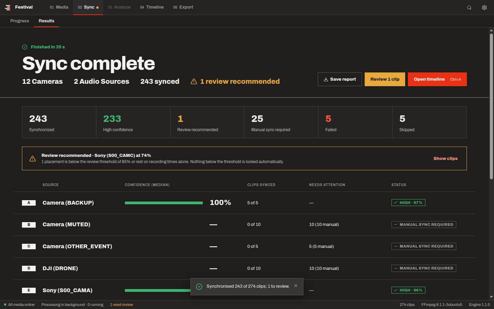
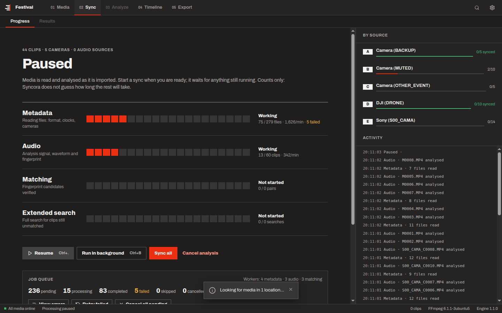

# Syncora

A desktop application that automatically synchronises multicamera video and external audio recordings, from a
single wedding to a multi-day production with thousands of files. It matches audio and timecode, flags anything
uncertain for review, and exports a timeline XML for DaVinci Resolve, Adobe Premiere Pro and Final Cut Pro. Original
media is never re-encoded, modified or deleted.

Built for wedding filmmakers, event videographers, documentary producers and multicam editors: hours of recorder
audio, hundreds or thousands of interrupted camera clips, mixed frame rates, drifting clocks.

**Stack:** Python (NumPy, SciPy) engine · FFmpeg · SQLite · Electron + React desktop app.



## Large productions

Version 1.1 processes a production as a background pipeline:

1. Discovery.
2. Metadata.
3. Audio analysis, with fingerprints.
4. Candidate pairs from a fingerprint index, never all pairs.
5. Verification.
6. Extended search.
7. A single sparse solve.

Every step is a task in the project file, so work can be paused, resumed, cancelled, retried or picked up after
a quit or crash. The media browser shows only what is on screen, whatever the project size.



What has been measured, on what hardware and with what results, is in
[SCALABILITY_TEST_REPORT.md](SCALABILITY_TEST_REPORT.md). It includes an end-to-end run of a generated
4,238-file production: 4,000 camera clips, 200 recorder files, and problem files.

Not in this version: transcription, speaker and marker analysis, and AI (visual or speech) sync. Clips that audio
cannot place go to an extended audio search, then to manual sync ([DESIGN_DECISIONS.md](DESIGN_DECISIONS.md) D-08).

## Installing

Installers for Windows 10/11 (64-bit) and macOS 12+ (Apple Silicon and Intel) are built and tested by the
[release workflow](.github/workflows/release.yml):

* `Syncora-Setup-1.1.1.exe`
* `Syncora-1.1.1-macOS-arm64.dmg`
* `Syncora-1.1.1-macOS-x64.dmg`

Download them from the repository's Releases page, or from the workflow run's artifacts.

The builds are not signed with a paid certificate yet, so the system asks once before the first launch:

* **Windows:** "Windows protected your PC" → **More info** → **Run anyway**.
* **macOS:** open the DMG and drag Syncora to Applications. The first launch is blocked: open
  **System Settings → Privacy & Security** and click **Open Anyway**.

Projects are `.syncora` files. Projects from Multicam Sync (`.mcsync`) open and are upgraded.

## Documentation

* [Architecture](docs/ARCHITECTURE.md): processes, key decisions, the pipeline, IPC contract, repository structure.
* [Technical specification](docs/TECHNICAL_SPEC.md): requirements, media and metadata, cache, timecode, timeline,
  corrections, export, SQLite schema, targets.
* [Synchronisation engine](docs/SYNC_ENGINE.md): the DSP and placement algorithms, candidate search, confidence
  model, measured accuracy and speed, limitations.
* [Scalability test report](SCALABILITY_TEST_REPORT.md): stress, accuracy and database benchmarks.
* [Changelog](CHANGELOG.md): what changed in each version.
* [Design decisions](DESIGN_DECISIONS.md): how the interface follows the Syncora design handoff, and what is not
  implemented yet.
* [Milestones](docs/MILESTONES.md): delivery plan with exit criteria.

## Engine quick start

```bash
cd engine
python -m pip install -e ".[dev]"
python -m pytest -m "not slow"        # unit, synthetic-offset, pipeline and end-to-end tests
python -m pytest -m slow              # hour-long recordings with clock drift
python scripts/benchmark_sync.py      # speed on 10 min / 1 h / 3 h references

# Synchronise real footage from the command line (needs FFmpeg on PATH)
mcsync sync /path/to/card_dumps --project wedding.syncora --jam-synced

# Write the timeline for Premiere Pro / Resolve (.xml) or Resolve / Final Cut Pro (.fcpxml)
mcsync export wedding.syncora wedding.xml
mcsync export wedding.syncora wedding.fcpxml --rate 25 --start-tc 01:00:00:00

# Benchmarks behind SCALABILITY_TEST_REPORT.md
python -m mcsync.testing.dbbench --media 5000 10000
python -m mcsync.testing.accuracy
python -m mcsync.testing.production FESTIVAL      # the 4,238-file test production (about 3 GB)
python -m mcsync.testing.stress FESTIVAL WORK --out report.json
```

```python
from mcsync.sync import ClipInput, SyncEngine, SyncOptions, prepare_signal

clips = [
    ClipInput("recorder", audio=prepare_signal(recorder_pcm, 48000), device_id="zoom"),
    ClipInput("camA_0001", audio=prepare_signal(cam_pcm, 48000), device_id="camA"),
]
result = SyncEngine(SyncOptions(reference_clip_id="recorder")).run(clips)
placement = result.placements["camA_0001"]
placement.start_s, placement.status, placement.confidence, placement.flags
```

## Desktop app quick start

Needs Node.js 22.12 or newer, Python 3.11 or newer, and FFmpeg on `PATH`.

```bash
python -m pip install -e engine           # the app runs the engine from source during development
cd app
npm ci
npm start                                 # build and launch
npm run dev                               # or: hot-reloading renderer

npm run typecheck && npm test             # unit tests
npm run build && npm run e2e              # the real app end to end (see app/e2e/README.md)
```

## Building the installers

Each installer is built on its own platform (what the release workflow does):

```bash
engine/packaging/build_ffmpeg.sh engine/dist/ffmpeg   # pinned, decode-only LGPL FFmpeg (needs nasm)
engine/packaging/build_engine.sh                      # frozen engine in engine/dist/mcsync-engine
cd app && npm ci && npm run build
npx electron-builder --win nsis --x64                 # or: --mac dmg --arm64 / --x64
pwsh scripts/installed-app.ps1 install                # or: scripts/installed-app.sh install arm64 (prints the path)
MCSYNC_E2E_APP="<installed Syncora executable>" npx playwright test e2e/app.spec.ts e2e/production.spec.ts
```
