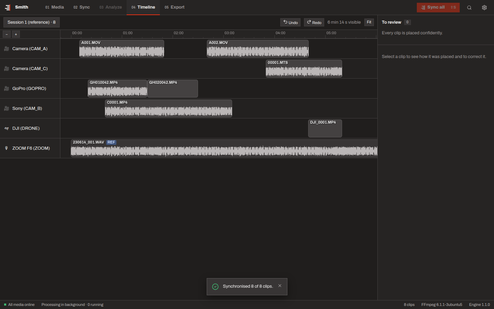

# Multicam Sync

A desktop application that automatically synchronises multicamera video and external audio recordings. It matches
waveforms and timecode, flags anything uncertain for review, and exports a timeline XML for DaVinci Resolve and Adobe
Premiere Pro. Original media is never re-encoded or modified.

Built for wedding filmmakers, event videographers, documentary producers and multicam editors: hours of recorder
audio, dozens of interrupted camera clips, mixed frame rates, drifting clocks.

**Stack:** Python (NumPy, SciPy) engine · FFmpeg · SQLite · Electron + React desktop shell.



## Status

| Milestone | State |
|---|---|
| M0 Architecture and specifications | ✅ [docs/](docs/) |
| M1 Synchronisation engine + automated tests | ✅ [engine/](engine/) |
| M2 Media layer (ffprobe/ffmpeg, cache, devices) | ✅ [engine/src/mcsync/media](engine/src/mcsync/media) |
| M3 Persistence, JSON-RPC service, CLI, parallel matching | ✅ [engine/src/mcsync/service](engine/src/mcsync/service) |
| M4 Desktop UI and timeline | ✅ [app/](app/) |
| M5 XML export (Resolve, Premiere) | ✅ [engine/src/mcsync/export](engine/src/mcsync/export) (NLE imports still to validate) |
| M6 Hardening, packaging, installers | next |

## Installing

Installers for Windows (64-bit) and macOS (Apple Silicon and Intel) are built by the
[release workflow](.github/workflows/release.yml). Download them from the repository's Releases page, or from the
workflow run's artifacts.

The builds are not signed with a paid certificate yet, so the system asks once before the first launch:

* **Windows:** "Windows protected your PC" → **More info** → **Run anyway**.
* **macOS:** open the DMG and drag Multicam Sync to Applications. The first launch is blocked: open
  **System Settings → Privacy & Security** and click **Open Anyway**.

## Documentation

* [Architecture](docs/ARCHITECTURE.md): processes, key decisions, module layout, IPC contract, repository structure.
* [Technical specification](docs/TECHNICAL_SPEC.md): requirements, media and metadata, cache, timecode, timeline,
  corrections, export, SQLite schema, targets.
* [Synchronisation engine](docs/SYNC_ENGINE.md): the DSP and placement algorithms, confidence model, measured
  accuracy and speed, limitations.
* [Milestones](docs/MILESTONES.md): delivery plan with exit criteria.

## Engine quick start

```bash
cd engine
python -m pip install -e ".[dev]"
python -m pytest -m "not slow"        # ~45 s: unit, synthetic-offset and end-to-end tests
python -m pytest -m slow              # hour-long recordings with clock drift
python scripts/benchmark_sync.py      # speed on 10 min / 1 h / 3 h references

# Synchronise real footage from the command line (needs FFmpeg on PATH)
mcsync sync /path/to/card_dumps --project wedding.mcsync --jam-synced

# Write the timeline for Premiere Pro / Resolve (.xml) or Resolve / Final Cut Pro (.fcpxml)
mcsync export wedding.mcsync wedding.xml
mcsync export wedding.mcsync wedding.fcpxml --rate 25 --start-tc 01:00:00:00
```

```python
from mcsync.sync import ClipInput, SyncEngine, SyncOptions, prepare_signal

clips = [
    ClipInput("recorder", audio=prepare_signal(recorder_pcm, 48000), device_id="zoom"),
    ClipInput("camA_0001", audio=prepare_signal(cam_pcm, 48000), device_id="camA"),
]
result = SyncEngine(SyncOptions(reference_clip_id="recorder")).run(clips)
placement = result.placements["camA_0001"]
placement.start_s, placement.status, placement.confidence, placement.flags
```

## Desktop app quick start

Needs Node.js 22.12 or newer, Python 3.11 or newer, and FFmpeg on `PATH`. Installers arrive in M6.

```bash
python -m pip install -e engine           # the app runs the engine from source during development
cd app
npm ci
npm start                                 # build and launch
npm run dev                               # or: hot-reloading renderer

npm run typecheck && npm test             # unit tests
npm run build && npm run e2e              # the real app end to end (see app/e2e/README.md)
```

## Building the installers

Each installer is built on its own platform (what the release workflow does):

```bash
engine/packaging/build_ffmpeg.sh engine/dist/ffmpeg   # pinned, decode-only LGPL FFmpeg (needs nasm)
engine/packaging/build_engine.sh                      # frozen engine in engine/dist/mcsync-engine
cd app && npm ci && npm run build
npx electron-builder --win nsis --x64                 # or: --mac dmg --arm64 / --x64
MCSYNC_E2E_APP="release/win-unpacked/Multicam Sync.exe" npx playwright test e2e/app.spec.ts
```
