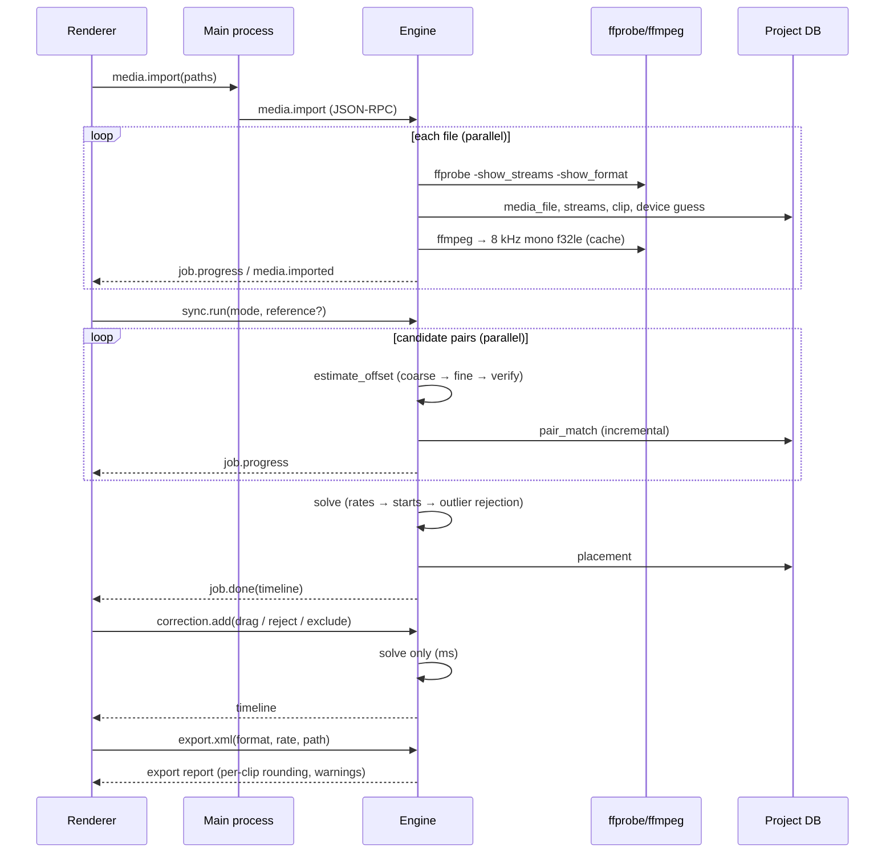

# Architecture

Multicam Sync is a desktop application that places multicamera video and external audio recordings on a common
timeline by matching their audio (and their timecode where it exists), lets the editor review uncertain results, and
exports a timeline to DaVinci Resolve and Adobe Premiere Pro. It never re-encodes or modifies the original media.

This document covers the system structure and the decisions behind it. [TECHNICAL_SPEC.md](TECHNICAL_SPEC.md) holds
formats, schemas and targets; [SYNC_ENGINE.md](SYNC_ENGINE.md) holds the synchronisation algorithms;
[MILESTONES.md](MILESTONES.md) holds the delivery plan.

## 1. Goals and constraints

| Goal | Consequence for the design |
|---|---|
| Non-destructive | Media is opened read-only by FFmpeg subprocesses; everything the app derives goes to a separate cache directory; exports reference original files by path. |
| Long projects (a wedding day: 10+ hours of media, 100–300 clips, 3 h continuous recorder tracks) | Analysis runs on a compact 8 kHz mono representation, streamed and memory-mapped; matching cost is dominated by a few FFTs per pair; results are persisted incrementally. |
| Accuracy the editor can trust | Sub-millisecond audio alignment, explicit confidence per clip, a review queue for anything uncertain. Wrong-but-confident results are the worst failure and are designed against first. |
| Interactive corrections | Expensive analysis and cheap placement are separate phases; manual edits only re-run the placement (milliseconds). |
| Local-first, private | No network access required; no media leaves the machine. |
| Cross-platform | macOS (arm64, x64) and Windows (x64) are release targets; Linux works for development and CI. |

## 2. System overview


| Process | Responsibilities | Must not |
|---|---|---|
| **Renderer** (React) | Media bin, sync controls, timeline view, review queue, export dialog. Holds UI state only. | Touch the filesystem, spawn processes, or hold authoritative project data. |
| **Main** (Electron/Node) | Window and menu lifecycle, native dialogs, spawning and supervising the engine, forwarding allow-listed RPC calls and notifications, reading cached waveform files for the renderer. | Contain business logic. It is a thin, well-tested bridge. |
| **Engine** (Python) | Media probing and audio extraction (through FFmpeg), analysis cache, synchronisation, project persistence, timeline export, job queue with progress and cancellation. | Depend on anything Electron-specific. It is also a standalone CLI and library. |
| **FFmpeg/ffprobe** | Decoding, downmixing and resampling audio to the analysis format; reading container metadata. | Write anywhere except the engine's stdout pipe. |

## 3. Key decisions

| # | Decision | Rationale | Alternatives rejected |
|---|---|---|---|
| D1 | **Python engine as a sidecar process speaking JSON-RPC 2.0 over stdio** (newline-delimited JSON). | NumPy/SciPy give fast, well-tested DSP. A child process isolates crashes, keeps the UI responsive, and can be killed to cancel. stdio opens no network port, so there are no firewall prompts and no attack surface. The same engine runs headless as a CLI and in CI. | Local HTTP server (open port, auth, firewall prompts); native Node addon (C++ DSP, harder to test and to build per platform); Pyodide/WASM (too slow for hours of audio, no FFmpeg). |
| D2 | **The engine is the only writer of the project file.** A project is one SQLite database (`*.mcsync`) in WAL mode. | One owner means no locking protocol between processes. SQLite is transactional, crash-safe and portable, and a single project file is easy to back up or send to a colleague. | JSON project files (no transactions, whole-file rewrites); a database in the main process (split ownership). |
| D3 | **FFmpeg is invoked as external binaries, never linked.** Ship LGPL builds without encoders. | Nothing is ever encoded, so a decode-only LGPL build is enough and licensing stays simple. Process isolation contains decoder crashes caused by damaged files. | PyAV/libav bindings (linking, packaging and licence complexity for no gain). |
| D4 | **Analysis runs on 8 kHz mono float32 audio**, extracted once per stream into a cache file and memory-mapped. | 8 kHz keeps the speech and music cues that matter for alignment. A 3 h recording is 345 MB. The analysis rate caps precision at about 10 µs, far below one video frame. | Full-rate analysis (6× the memory and time, no accuracy benefit); pure fingerprinting (drops the sub-sample precision that audio mixing needs). |
| D5 | **Two-phase synchronisation: `analyze` (pairwise matching, persisted) then `solve` (global placement, milliseconds).** | Manual corrections, reference changes and mode switches re-run only `solve`, so the timeline updates instantly. An interrupted analysis resumes from the stored pairs. | A monolithic sync call (every edit re-runs minutes of DSP). |
| D6 | **Placement is a graph problem.** Clips, clock domains and manual constraints are nodes and edges; a weighted least-squares solve with outlier rejection places everything. | Interrupted clips, clips outside the main recorder's coverage (placed transitively), timecode, creation-time metadata and manual edits all fit one model. Contradictory measurements are detected, not silently averaged. | Syncing everything against one reference track (fails whenever the reference is interrupted). |
| D7 | **Drift-aware clock model:** each clip has a start *and* a clock-rate error. | Consumer devices drift 5–50 ppm, which is 18–180 ms per hour. Treating offsets as constants makes correct measurements contradict each other over long recordings (reproduced in the test suite). | Constant offsets with widened tolerances (hides real errors). |
| D8 | **Times are float64 seconds inside the engine; frame rates are exact rationals** (`Fraction(30000, 1001)`), and frames appear only at the metadata-import and export boundaries. | float64 seconds resolve under a microsecond over 24 h. Each clip keeps its native rate, so mixed-rate projects need no special case until export. | Frames as the internal unit (which rate?); float frame rates (29.97 ≠ 30000/1001 accumulates error). |
| D9 | **Export FCP7 XML (xmeml v5) first; FCPXML second.** | Both Premiere Pro and DaVinci Resolve import xmeml. FCPXML adds rational (sample-accurate) timing that Resolve can use. | AAF (complex, little benefit for v1); EDL (single track, no audio mapping). |

## 4. Engine structure

```
engine/src/mcsync/
├── timecode.py        SMPTE timecode, drop-frame, rational frame rates                 [M1 ✅]
├── sync/                                                                              [M1 ✅]
│   ├── params.py      tunable parameters (documented defaults)
│   ├── types.py       inputs, results, flags, statuses
│   ├── signal.py      decoded PCM → analysis signal (downmix, resample, band-pass)
│   ├── features.py    log-energy envelope for the coarse search
│   ├── correlation.py FFT cross-correlation, GCC-PHAT, peak picking
│   ├── pairwise.py    coarse-to-fine offset + drift estimation between two clips
│   ├── confidence.py  evidence → confidence → confident / uncertain / no match
│   ├── solver.py      global drift-aware placement, clock domains, manual constraints
│   └── engine.py      orchestration: pair selection, clock priors, analyze/solve
├── testing/           synthetic.py (scenes, recordings) · media.py (FFmpeg-generated shoots)   [M1–M2 ✅]
├── media/             probe · riff · extract · cache · fingerprint · devices · waveform · library   [M2 ✅]
├── project/           schema.sql · db.py (project file, corrections log, pair matches)  [M3 ✅]
├── service/           rpc.py · jobs.py · app.py (all methods) · __main__.py            [M3 ✅]
├── timeline.py        timeline model and review queue (UI and export)                  [M3 ✅]
├── serialize.py       JSON conversion for the project file and the protocol            [M3 ✅]
├── export/            sequence.py (NLE sequence, exact rational placement, report) ·
│                      xmeml.py · fcpxml.py · urls.py                                   [M5 ✅]
└── cli.py             `mcsync serve | probe | sync <folders> [--project]`             [M3 ✅]
```

Dependencies point one way: `service → project, media, sync, export`; `sync` depends only on NumPy/SciPy and knows
nothing about files, FFmpeg or SQLite. This keeps the DSP core testable with synthetic arrays and lets the media layer
change (for example to memory-mapped caches) without touching it.

## 5. End-to-end data flow



## 6. IPC contract

Renderer → main uses a single `window.mcsync.invoke(method, params)` exposed through `contextBridge`, plus
`window.mcsync.on(event, handler)` for notifications. Main forwards calls unchanged to the engine. The TypeScript
types are generated from the engine's JSON schemas so both sides share one contract.

Implemented in M3 (`engine/src/mcsync/service/`), protocol version 1. Ids are the project database's integer ids.

| Method | Params → Result | Notes |
|---|---|---|
| `engine.hello` / `engine.shutdown` | `{client?}` → `{version, protocol, ffmpeg, cache_dir, workers}` | The main process refuses a mismatched protocol version. |
| `project.create` / `project.open` / `project.close` / `project.info` | `{path, name?}` → project summary | Opening refreshes media online/offline status. |
| `project.update_settings` | `{mode?, reference_clip_id?, timecode_jam_synced?, use_creation_time?}` → settings | |
| `media.import` | `{paths[], recursive?}` → `{job_id}` | Scans, probes, stores, extracts. Emits `media.imported` per file. |
| `media.list` / `media.remove` | → `{clips[], devices[]}` | Clip summaries: rate, VFR, timecode, streams, chapter. |
| `device.update`, `clip.assign_device`, `clip.set_audio` | → updated listing / clip | Device identity drives pairing and clock domains. |
| `sync.run` | `{mode?, reference_clip_id?, timecode_jam_synced?}` → `{job_id}` | Incremental and resumable; the result has `pairs`, `reused`, `matched` and the timeline. |
| `sync.solve` | → timeline | Re-runs placement only (milliseconds). |
| `sync.snap` | `{clip_id, anchor_clip_id, approx_offset_s, radius_s}` → match | "Snap to audio" after a rough drag; not saved. |
| `correction.add` / `.undo` / `.redo` / `.list` | correction → timeline | Append-only log. |
| `timeline.get` | → groups, tracks, clips, unsynced, review queue, stats | |
| `waveform.info` | `{clip_id}` → cache directory, peak files, rate, audio offset | The renderer then reads the peak files itself. |
| `job.cancel` / `job.list` | `{job_id}` | Cooperative cancellation between files, chunks and pairs. |
| `export.xml` | `{format: "xmeml"\|"fcpxml", path, sequence_rate?, start_timecode?, group?, include_uncertain?, name?}` → report | Writes atomically. The report gives per-clip placement errors as the format's readers see them, clips left out and why, and warnings. Every export is recorded in the project file. |
| **Notifications** | `job.progress {job_id, kind, progress, message}` · `job.done {job_id, kind, result}` · `job.failed {job_id, kind, cancelled, error}` · `media.imported` | Progress throttled to 10 Hz. |

Errors are JSON-RPC errors: −32700/−32600/−32601/−32602/−32603, plus −32000 no project open, −32001 busy (a
conflicting job runs), −32002 application error, −32003 FFmpeg missing.

Large binary data (waveform peaks) never goes through JSON. The engine writes peak pyramids into the cache and
`waveform.info` says where; the renderer asks the main process for the bytes (`peaks:read` IPC). The main process
only reads `peaks_<n>.i8` files inside the engine's cache directory.

The renderer reaches the system only through `window.mcsync` (`app/electron/preload.ts`): `invoke` for allow-listed
engine methods (typed by `app/src/api/contract.ts`), engine events, native file dialogs, dropped-file paths and
`readPeaks`. The renderer runs sandboxed with context isolation and a strict Content Security Policy.

## 7. Repository layout

```
.
├── README.md
├── docs/                      architecture, specification, sync engine, milestones        [M0 ✅]
├── engine/                    Python engine (library + CLI + JSON-RPC sidecar)
│   ├── pyproject.toml                                                                     [M1 ✅]
│   ├── src/mcsync/            see §4
│   ├── tests/                 unit, synthetic-audio and end-to-end tests                  [M1 ✅]
│   ├── scripts/benchmark_sync.py                                                           [M1 ✅]
│   └── packaging/             build_ffmpeg.sh · build_engine.sh (PyInstaller spec)          [M6 ✅]
├── app/                       Electron + React + TypeScript                               [M4 ✅]
│   ├── package.json · vite.config.ts · playwright.config.ts · scripts/ (build, dev)
│   ├── electron/              main.ts (window, menus, dialogs, IPC) · engine.ts (supervisor) · preload.ts
│   ├── src/
│   │   ├── api/               contract.ts (RPC payload types, bridge) · client.ts
│   │   ├── state/             store.ts (Zustand: project, media, timeline, jobs, selection, view)
│   │   ├── features/          welcome · media · sync (toolbar) · timeline · inspector (review queue)
│   │   ├── components/        status bar, toasts
│   │   └── lib/               formatting, plain-language labels for flags and reasons
│   ├── tests/                 Vitest unit tests (format, geometry, waveform maths, store)
│   └── e2e/                   Playwright-for-Electron: workflow test, 300-clip benchmark
├── fixtures/export/           golden xmeml and FCPXML files (test media is generated)    [M5 ✅]
└── .github/workflows/         engine-ci.yml [M1 ✅] · app-ci.yml [M4 ✅] · release.yml [M6 ✅]
```

## 8. Concurrency and performance model

* **Engine process:** the RPC loop runs on the main thread and never blocks. Jobs run on a worker pool.
  * Extraction runs ffmpeg subprocesses in parallel (default: half the cores).
  * Pairwise matching runs in a `ProcessPoolExecutor`. Pairs are independent, and each worker memory-maps the cached
    signals instead of receiving copies.
  * `solve` runs inline because it takes milliseconds.
* **Cancellation:** every job holds a token checked between pairs and between extraction chunks. Killing an ffmpeg
  child is always safe because nothing it writes is final until renamed.
* **Incremental persistence:** each pair match is committed as it finishes. A crash or cancel loses at most the pairs
  that were in flight.
* **Pair pruning:** clips from the same device are never paired (they cannot overlap), and clock readings exclude pairs
  that cannot overlap. A wrong candidate is abandoned after a few spread-out verification windows.

## 9. Security and robustness

* **Electron hardening:** the renderer runs with `contextIsolation: true`, `sandbox: true` and `nodeIntegration: false`,
  under a strict Content Security Policy. The preload exposes exactly two functions.
* **Path handling:** the engine accepts paths only from user dialogs and drag-and-drop (checked by main) and from its
  own database. Media files are opened read-only. Cache writes use temp-file-and-rename.
* **Untrusted input:** media files are untrusted. Parsing is done by FFmpeg in a child process with a timeout. ffprobe
  JSON is validated before use.
* **Engine supervision:** main pings the engine and restarts it on crash. The UI shows that a job failed and offers to
  resume it; it never loses the project.

## 10. Packaging and distribution (M6)

* The engine is frozen with PyInstaller (one-folder mode for fast start-up) and shipped in the Electron app's
  resources (`engine/`).
* Next to it (`ffmpeg/`) is FFmpeg built from source by `engine/packaging/build_ffmpeg.sh`:
  * the same pinned release on every platform;
  * LGPL, static, decode only;
  * shipped with its licence and recipe.

  The app points the engine at it with `MCSYNC_FFMPEG_DIR`.
* The engine owns its stdio: it reads and writes the protocol through private descriptors, and gives child processes
  (FFmpeg, the matcher pool) the null device and stderr.
* electron-builder (`app/electron-builder.yml`) produces DMGs for arm64 and x64 and an NSIS installer for x64. Each
  is built natively by `.github/workflows/release.yml` and tested there with the end-to-end suite against the
  packaged app.
* Signing: with the signing secrets, a Developer ID signature plus notarisation on macOS, and Authenticode on
  Windows. Without them, macOS builds are ad-hoc signed and Windows builds unsigned.
* Auto-update through electron-updater is post-v1.
* No telemetry. Crash reports are written locally and attached by the user if they choose.

## 11. Testing strategy

| Layer | What | Where |
|---|---|---|
| DSP unit tests | Correlation conventions, sub-sample interpolation, PHAT behaviour, envelopes, timecode arithmetic | `engine/tests/test_*` [M1 ✅] |
| Synthetic property tests | Known offsets under randomised noise, reverb, EQ, gain, sample rate, drift; unrelated-audio rejection | `engine/tests/test_pairwise.py` [M1 ✅] |
| Solver tests | Outliers, manual constraints, clock domains, drift model, detached groups | `engine/tests/test_solver.py` [M1 ✅] |
| End-to-end engine tests | Wedding-style multicam shoots, hybrid timecode, interrupted clips | `engine/tests/test_engine.py` [M1 ✅] |
| Media integration | Real containers generated with FFmpeg (MOV/MP4/MTS/BWF, tmcd, drop-frame, chapters, delayed audio, truncation) | `engine/tests/test_media_*.py` [M2 ✅] |
| Export | Exact placement rules; golden files diffed against reviewed references; read-backs with OpenTimelineIO (xmeml) and a reader of FCPXML's timing rules; the real synced shoot exported and checked against the truth | `engine/tests/test_export.py`, `test_service.py` [M5 ✅] |
| NLE import checklist | Resolve and Premiere imports on every release candidate, per the matrix in the spec | not done yet: needs the NLEs (M6) |
| UI unit tests | Formatting, timeline geometry, waveform maths (checked against the engine's μ-law decoder), store actions against a fake bridge | `app/tests/` [M4 ✅] |
| UI end-to-end | Playwright for Electron with the real engine: new project → import a generated shoot → sync (positions checked against the truth) → inspect → drag → undo → nudge → snap → reject/restore → export both formats → reopen | `app/e2e/app.spec.ts` [M4 ✅, M5 ✅] |
| UI performance | 300-clip, 3-hour project served by a stand-in engine; frame intervals while panning and zooming | `app/e2e/timeline-perf.spec.ts` [M4 ✅] |
| Benchmarks | `scripts/benchmark_sync.py`; regressions tracked per release | M1 ✅ |
