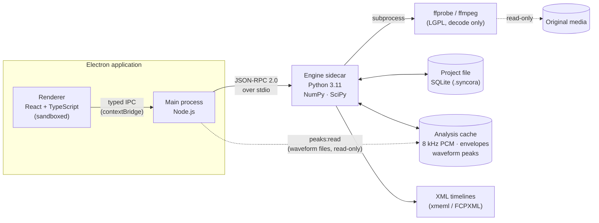
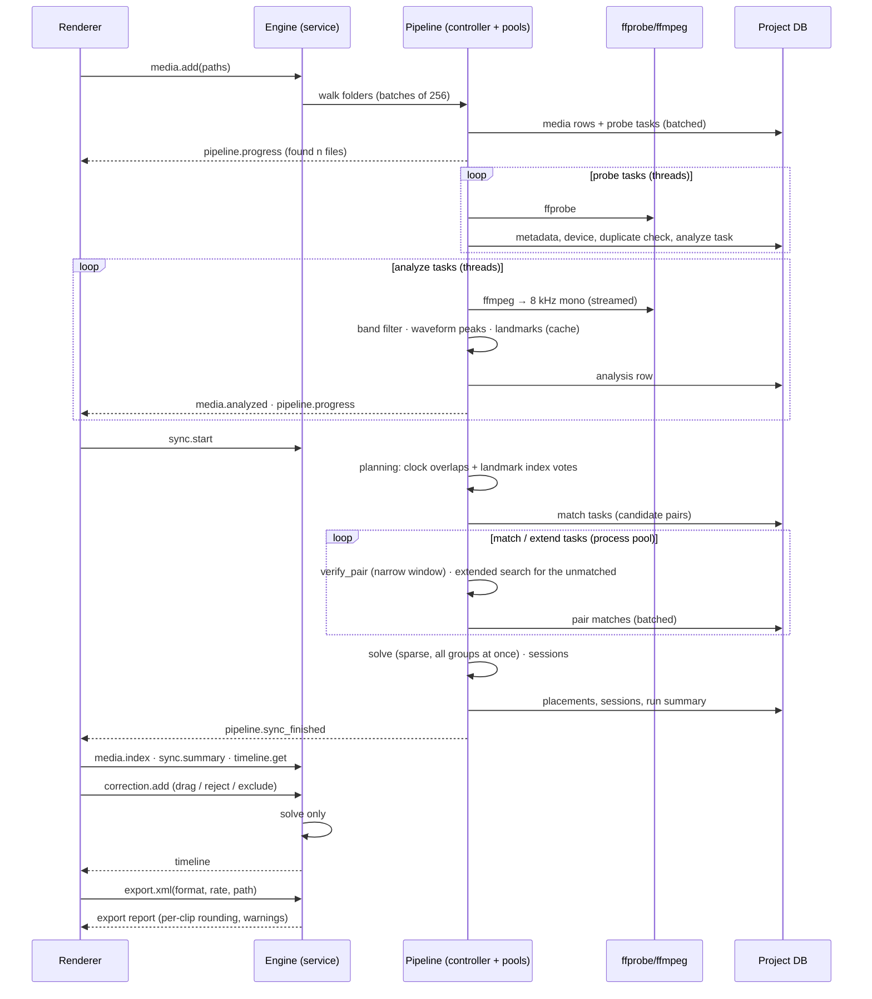

# Architecture

Syncora (formerly Syncora) is a desktop application that places multicamera video and external audio
recordings on a common timeline by matching their audio (and their timecode where it exists), lets the editor review
uncertain results, and exports a timeline to DaVinci Resolve and Adobe Premiere Pro. It never re-encodes, modifies or
deletes the original media. Version 1.1 is built for large productions: thousands of files across many sessions
(see [SCALABILITY_TEST_REPORT.md](../SCALABILITY_TEST_REPORT.md) for what has been measured).

This document covers the system structure and the decisions behind it. [TECHNICAL_SPEC.md](TECHNICAL_SPEC.md) holds
formats, schemas and targets; [SYNC_ENGINE.md](SYNC_ENGINE.md) holds the synchronisation algorithms;
[MILESTONES.md](MILESTONES.md) holds the delivery plan.

## 1. Goals and constraints

| Goal | Consequence for the design |
|---|---|
| Non-destructive | Media is opened read-only by FFmpeg subprocesses; everything the app derives goes to a separate cache directory; exports reference original files by path. |
| Long projects (a wedding day: 10+ hours of media, 100–300 clips, 3 h continuous recorder tracks) | Analysis runs on a compact 8 kHz mono representation, streamed and memory-mapped; matching cost is dominated by a few FFTs per pair; results are persisted incrementally. |
| Large productions (festivals, multi-day events: 4,000+ files, several TB, dozens of sessions) | Work is a persistent task queue in the project file, processed in the background by bounded worker pools; no stage holds more than one file's audio per worker; which clips to compare comes from an audio-fingerprint index instead of all pairs; placement is one sparse solve; the interface loads a compact index and renders only what is on screen (`media.index`, §6). |
| Accuracy the editor can trust | Sub-millisecond audio alignment, explicit confidence per clip, a review queue for anything uncertain. Wrong-but-confident results are the worst failure and are designed against first. |
| Interactive corrections | Expensive analysis and cheap placement are separate phases; manual edits only re-run the placement (milliseconds for a wedding, about a second at 4,000 clips). |
| Local-first, private | No network access required; no media leaves the machine. |
| Cross-platform | macOS (arm64, x64) and Windows (x64) are release targets; Linux works for development and CI. |

## 2. System overview



| Process | Responsibilities | Must not |
|---|---|---|
| **Renderer** (React) | Media bin, sync controls, timeline view, review queue, export dialog. Holds UI state only. | Touch the filesystem, spawn processes, or hold authoritative project data. |
| **Main** (Electron/Node) | Window and menu lifecycle, native dialogs, spawning and supervising the engine, forwarding allow-listed RPC calls and notifications, reading cached waveform files for the renderer. | Contain business logic. It is a thin, well-tested bridge. |
| **Engine** (Python) | Media probing and audio extraction (through FFmpeg), analysis cache, synchronisation, project persistence, timeline export, job queue with progress and cancellation. | Depend on anything Electron-specific. It is also a standalone CLI and library. |
| **FFmpeg/ffprobe** | Decoding, downmixing and resampling audio to the analysis format; reading container metadata. | Write anywhere except the engine's stdout pipe. |

## 3. Key decisions

| # | Decision | Rationale | Alternatives rejected |
|---|---|---|---|
| D1 | **Python engine as a sidecar process speaking JSON-RPC 2.0 over stdio** (newline-delimited JSON). | NumPy/SciPy give fast, well-tested DSP. A child process isolates crashes, keeps the UI responsive, and can be killed to cancel. stdio opens no network port, so there are no firewall prompts and no attack surface. The same engine runs headless as a CLI and in CI. | Local HTTP server (open port, auth, firewall prompts); native Node addon (C++ DSP, harder to test and to build per platform); Pyodide/WASM (too slow for hours of audio, no FFmpeg). |
| D2 | **The engine is the only writer of the project file.** A project is one SQLite database (`*.syncora`; `*.mcsync` from earlier versions opens and is upgraded) in WAL mode. | One owner means no locking protocol between processes. SQLite is transactional, crash-safe and portable, and a single project file is easy to back up or send to a colleague. | JSON project files (no transactions, whole-file rewrites); a database in the main process (split ownership). |
| D3 | **FFmpeg is invoked as external binaries, never linked.** Ship LGPL builds without encoders. | Nothing is ever encoded, so a decode-only LGPL build is enough and licensing stays simple. Process isolation contains decoder crashes caused by damaged files. | PyAV/libav bindings (linking, packaging and licence complexity for no gain). |
| D4 | **Analysis runs on 8 kHz mono float32 audio**, extracted once per stream into a cache file and memory-mapped. | 8 kHz keeps the speech and music cues that matter for alignment. A 3 h recording is 345 MB. The analysis rate caps precision at about 10 µs, far below one video frame. | Full-rate analysis (6× the memory and time, no accuracy benefit); pure fingerprinting (drops the sub-sample precision that audio mixing needs). |
| D5 | **Two-phase synchronisation: `analyze` (pairwise matching, persisted) then `solve` (global placement, milliseconds).** | Manual corrections, reference changes and mode switches re-run only `solve`, so the timeline updates instantly. An interrupted analysis resumes from the stored pairs. | A monolithic sync call (every edit re-runs minutes of DSP). |
| D6 | **Placement is a graph problem.** Clips, clock domains and manual constraints are nodes and edges; a weighted least-squares solve with outlier rejection places everything. | Interrupted clips, clips outside the main recorder's coverage (placed transitively), timecode, creation-time metadata and manual edits all fit one model. Contradictory measurements are detected, not silently averaged. | Syncing everything against one reference track (fails whenever the reference is interrupted). |
| D7 | **Drift-aware clock model:** each clip has a start *and* a clock-rate error. | Consumer devices drift 5–50 ppm, which is 18–180 ms per hour. Treating offsets as constants makes correct measurements contradict each other over long recordings (reproduced in the test suite). | Constant offsets with widened tolerances (hides real errors). |
| D8 | **Times are float64 seconds inside the engine; frame rates are exact rationals** (`Fraction(30000, 1001)`), and frames appear only at the metadata-import and export boundaries. | float64 seconds resolve under a microsecond over 24 h. Each clip keeps its native rate, so mixed-rate projects need no special case until export. | Frames as the internal unit (which rate?); float frame rates (29.97 ≠ 30000/1001 accumulates error). |
| D9 | **Export FCP7 XML (xmeml v5) first; FCPXML second.** | Both Premiere Pro and DaVinci Resolve import xmeml. FCPXML adds rational (sample-accurate) timing that Resolve can use. | AAF (complex, little benefit for v1); EDL (single track, no audio mapping). |
| D10 | **All background work is a task table in the project file** (`probe` per file, `analyze` per clip, `match` / `extend` per pair), claimed by priority. | Pause, resume, cancel, retry and reprioritise are row updates; a crash or quit loses only the tasks in flight; the interface counts pending / processing / completed / failed / skipped straight from the table. | In-memory job lists (lost on quit, nothing to resume). |
| D11 | **Candidate pairs come from an audio-fingerprint index** (landmark hashes, inverted index on disk), plus clock overlaps; only candidates are verified by the full matcher, inside a narrow window. | All pairs grow with the square of the clip count (8.8 million at 4,200 clips); overlapping pairs grow linearly. | All pairs within a time window (fails when clocks are wrong or missing, which is when sync is needed most). |
| D12 | **Uncertain matches only bridge.** An uncertain match is used to attach clips that nothing stronger places, one device at a time; it never merges two groups that already hold several devices. | At thousands of clips a few confident-looking but wrong matches are inevitable; wrong joins between sessions were the costliest error. Such clips still land in Review, never locked. | Weighting uncertain matches lower (still pulled whole sessions onto one timeline). |

## 4. Engine structure

```
engine/src/mcsync/
├── timecode.py        SMPTE timecode, drop-frame, rational frame rates                 [M1 ✅]
├── resources.py       processors, memory, disk speed, GPU (reported, unused) → worker plan  [1.1 ✅]
├── pipeline/          discovery.py (incremental scandir walk) · runner.py (task queue,     [1.1 ✅]
│                      worker pools, sync phases, sessions, duplicates, resume)
├── sync/                                                                              [M1 ✅]
│   ├── params.py      tunable parameters (documented defaults)
│   ├── types.py       inputs, results, flags, statuses
│   ├── signal.py      decoded PCM → analysis signal (downmix, resample, band-pass)
│   ├── features.py    log-energy envelope for the coarse search
│   ├── correlation.py FFT cross-correlation, GCC-PHAT, peak picking
│   ├── pairwise.py    coarse-to-fine offset + drift estimation between two clips
│   ├── confidence.py  evidence → confidence → confident / uncertain / no match
│   ├── solver.py      global drift-aware placement, clock domains, manual constraints (sparse, vectorised)
│   ├── landmarks.py   audio landmark fingerprints, bucketed on-disk inverted index, offset votes  [1.1 ✅]
│   ├── candidates.py  the candidate funnel: clocks → landmarks → extended search → manual       [1.1 ✅]
│   └── engine.py      orchestration: pair selection, clock priors, analyze/solve, verify_pair
├── testing/           synthetic.py (scenes, recordings) · media.py (FFmpeg-generated shoots)   [M1–M2 ✅]
│                      production.py (multi-session productions with truth) · stress.py · accuracy.py ·
│                      dbbench.py (benchmarks, see SCALABILITY_TEST_REPORT.md)                    [1.1 ✅]
├── media/             probe · riff · extract · cache · fingerprint · devices · waveform · library ·
│                      thumbnail                                                                   [M2 ✅]
├── project/           schema.sql · migrations.py · db.py (project file, task queue, sessions,
│                      duplicates, corrections log, pair matches)                                  [M3, 1.1 ✅]
├── ai/                models.py (shipped and downloadable models) · speech.py (Silero VAD + Whisper + voice
│                      fingerprints) · speakers.py · visual.py (brightness changes) · aisync.py (evidence,
│                      candidates, confidence)                                                   [1.2 ✅]
├── service/           rpc.py · jobs.py · app.py (all methods) · ai_methods.py · __main__.py   [M3, 1.2 ✅]
├── timeline.py        timeline model and review queue (UI and export)                  [M3 ✅]
├── serialize.py       JSON conversion for the project file and the protocol            [M3 ✅]
├── export/            sequence.py (NLE sequence, exact rational placement, report) ·
│                      xmeml.py · fcpxml.py · urls.py                                   [M5 ✅]
└── cli.py             `mcsync serve | probe | sync <folders> [--project] | export | transcribe`  [M3, 1.2 ✅]
```

Dependencies point one way: `service → project, media, sync, export`; `sync` depends only on NumPy/SciPy and knows
nothing about files, FFmpeg or SQLite. This keeps the DSP core testable with synthetic arrays and lets the media layer
change (for example to memory-mapped caches) without touching it.

## 5. End-to-end data flow



The pipeline runs whenever a project is open: adding media queues its probe and analysis at once, so a production
is analysed while it is still being imported. A sync run records its phase in the project (`waiting → planning →
matching → extending → solving`), and a project closed mid-run offers to resume it when it opens again.

## 6. IPC contract

Renderer → main uses a single `window.mcsync.invoke(method, params)` exposed through `contextBridge`, plus
`window.mcsync.on(event, handler)` for notifications. Main forwards calls unchanged to the engine. The TypeScript
types are generated from the engine's JSON schemas so both sides share one contract.

Implemented in `engine/src/mcsync/service/`, protocol version 2 (Syncora 1.1). Ids are the project database's
integer ids.

| Method | Params → Result | Notes |
|---|---|---|
| `engine.hello` / `engine.shutdown` | `{client?}` → `{version, protocol, ffmpeg, cache_dir, workers}` | The main process refuses a mismatched protocol version. |
| `project.create` / `project.open` / `project.close` / `project.info` / `project.stats` | `{path, name?}` → project summary | Opening refreshes media online/offline status and reports unfinished work (`resume`). |
| `engine.configure`, `system.resources`, `system.disk_speed` | worker plan, detected hardware | Auto or manual worker counts per stage. |
| `media.add` | `{paths[]}` → `{found}` | Queues discovery; the pipeline takes it from there (progress by notification). |
| `media.index` | → `{columns, rows, devices, sessions, version}` | Every clip as one compact row (columnar), for the windowed browser, search and bins. |
| `media.duplicates` / `media.decide_duplicates` | → duplicates · `{media_ids, decision: keep\|ignore}` | Identical or probable copies; nothing is deleted. |
| `media.offline` / `media.relink_folder` / `media.relink_file` / `media.ignore_offline` / `media.rescan` | | Offline volumes and relinking by name, size and content. |
| `media.thumbnails` | `{clip_ids}` | Frames rendered into the cache; delivered by notification. |
| `session.list` / `session.create` / `session.assign`, `device.create` | | Sessions (groups) and cameras; hand-made groups survive recalculation. |
| `pipeline.status` / `.pause` / `.resume` / `.restart` | → status | Counts per stage: pending, processing, completed, failed, skipped, cancelled. |
| `tasks.list` / `.cancel` / `.retry` / `.prioritize` / `.analyze` | `{clip_ids?, kinds?, statuses?}` | Bulk actions on the queue. |
| `sync.start` / `sync.cancel` / `sync.summary` / `sync.matches` | | Background sync run; summary by category (synchronized, high confidence, review, manual, failed, skipped) and by source. |
| `cache.info` / `cache.clear_unused` | | |
| `project.update_settings` | `{mode?, reference_clip_id?, timecode_jam_synced?, use_creation_time?}` → settings | |
| `media.import` | `{paths[], recursive?}` → `{job_id}` | Scans, probes, stores, extracts. Emits `media.imported` per file. |
| `media.list` / `media.remove` | → `{clips[], devices[]}` | Clip summaries: rate, VFR, timecode, streams, chapter. |
| `device.update`, `clip.assign_device`, `clip.set_audio` | → updated listing / clip | Device identity drives pairing and clock domains. |
| `sync.run` | `{mode?, reference_clip_id?, timecode_jam_synced?}` → `{job_id}` | Incremental and resumable; the result has `pairs`, `reused`, `matched` and the timeline. |
| `sync.solve` | → timeline | Re-runs placement only (milliseconds). |
| `sync.snap` | `{clip_id, anchor_clip_id, approx_offset_s, radius_s}` → match | "Snap to audio" after a rough drag; not saved. |
| `correction.add` / `.undo` / `.redo` / `.list` | correction → timeline | Append-only log. |
| `timeline.get` | → groups, tracks, clips, unsynced, review queue, stats | |
| `waveform.info` | `{clip_id}` → cache directory, peak files, rate, audio offset | The renderer then reads the peak files itself. |
| `job.cancel` / `job.list` | `{job_id}` | Cooperative cancellation between files, chunks and pairs. |
| `export.xml` | `{format: "xmeml"\|"fcpxml", path, sequence_rate?, start_timecode?, group?, include_uncertain?, name?}` → report | Writes atomically. The report gives per-clip placement errors as the format's readers see them, clips left out and why, and warnings. Every export is recorded in the project file. |
| `ai.status` / `ai.download_model` / `ai.remove_model` | → engine, models, languages · `{model_id}` → `{job_id}` | Models shipped with the app or downloaded to the cache folder (1.2). |
| `transcripts.start` / `.cancel` / `.overview`, `transcript.get` | `{scope: smart\|all\|clips, clip_ids?, redo?}` · `{clip_id}` → segments, state, markers | Transcription runs as `transcribe` tasks (10-minute parts) in the pipeline. A clip without its own transcript gets what its sync group's transcribed recordings heard (1.2). |
| `speakers.list` / `.rename` / `.merge` | `{key, name}` · `{keys, into}` | Voices across the project (1.2). |
| `markers.list` / `.add` / `.update` / `.delete` | `{clip_id, t_s, label?}` | Sound events heard while transcribing and markers added by hand (1.2). |
| `search.query` | `{text, limit?}` → hits with `score` and `matched_by` | Phrase, all words or some words (FTS5), speaker names, markers, clip names (1.2). |
| `ai.sync` / `.sync_result` / `.sync_accept` / `.sync_reject` / `ai.fallback` | `{clip_id, candidate?}` | AI sync: candidates from speech, visual, close-range audio and clock evidence; accepting adds an undoable offset correction (1.2). |
| **Notifications** | `job.progress {job_id, kind, progress, message}` · `job.done {job_id, kind, result}` · `job.failed {job_id, kind, cancelled, error}` · `media.imported` · `media.analyzed` · `media.thumbnails` · `pipeline.progress` (status) · `pipeline.matches` · `pipeline.sync_finished` · `pipeline.error` · `transcript.updated {clip_ids}` · `ai.fallback_done {clips, placed}` | Progress throttled to 10 Hz (pipeline: 4 Hz). |

Errors are JSON-RPC errors: −32700/−32600/−32601/−32602/−32603, plus −32000 no project open, −32001 busy (a
conflicting job runs), −32002 application error, −32003 FFmpeg missing.

Large binary data (waveform peaks) never goes through JSON. The engine writes peak pyramids into the cache and
`waveform.info` says where; the renderer asks the main process for the bytes (`peaks:read` IPC). The main process
only reads `peaks_<n>.i8` files inside the engine's cache directory.

The renderer reaches the system only through `window.mcsync` (`app/electron/preload.ts`): `invoke` for allow-listed
engine methods (typed by `app/src/api/contract.ts`), engine events, native file dialogs, dropped-file paths and
`readPeaks`. The renderer runs sandboxed with context isolation and a strict Content Security Policy.

## 7. Repository layout

```
.
├── README.md
├── docs/                      architecture, specification, sync engine, milestones        [M0 ✅]
├── engine/                    Python engine (library + CLI + JSON-RPC sidecar)
│   ├── pyproject.toml                                                                     [M1 ✅]
│   ├── src/mcsync/            see §4
│   ├── tests/                 unit, synthetic-audio and end-to-end tests                  [M1 ✅]
│   ├── scripts/benchmark_sync.py                                                           [M1 ✅]
│   └── packaging/             build_ffmpeg.sh · build_engine.sh (PyInstaller spec)          [M6 ✅]
├── app/                       Electron + React + TypeScript                               [M4 ✅]
│   ├── package.json · vite.config.ts · playwright.config.ts · scripts/ (build, dev)
│   ├── electron/              main.ts (window, menus, dialogs, IPC) · engine.ts (supervisor) · preload.ts
│   ├── src/
│   │   ├── api/               contract.ts (RPC payload types, bridge) · client.ts
│   │   ├── design-system/     Syncora tokens (verbatim), Archivo, components (DESIGN_DECISIONS.md)
│   │   ├── shell/             top bar (stages 01–05), status bar
│   │   ├── screens/           home · media (import, browser) · sync (analysis, results) · settings · dialogs
│   │   ├── state/             store.ts (project, timeline, jobs) · production.ts (index, pipeline, bins,
│   │   │                      search, selection) · thumbs.ts
│   │   ├── features/          timeline · inspector (review queue) · export
│   │   ├── components/        toasts
│   │   └── lib/               formatting, labels, search grammar (query.ts), windowing (virtual.ts)
│   ├── tests/                 Vitest unit tests (format, geometry, waveform maths, store, search, windowing)
│   └── e2e/                   Playwright-for-Electron: editor workflow, 279-file production, 300-clip timeline benchmark
├── fixtures/export/           golden xmeml and FCPXML files (test media is generated)    [M5 ✅]
└── .github/workflows/         engine-ci.yml [M1 ✅] · app-ci.yml [M4 ✅] · release.yml [M6 ✅]
```

## 8. Concurrency and performance model

* **Pipeline:** one controller thread claims tasks from the project's task table in priority order and feeds three
  bounded pools sized by `resources.recommend_workers()` (or by hand in Settings → Performance): metadata (threads;
  the disk is the limit), audio analysis (threads, each driving one FFmpeg decoder; the DSP runs in NumPy/SciPy
  outside the interpreter lock) and matching (processes). At most a few tasks per worker are in flight, so memory
  stays flat whatever the size of the production; results are written back in batches.
* **Engine process:** the RPC loop runs on the main thread and never blocks. Jobs run on a worker pool.
  * Extraction runs ffmpeg subprocesses in parallel (default: half the cores).
  * Pairwise matching runs in a `ProcessPoolExecutor`. Pairs are independent, and each worker memory-maps the cached
    signals instead of receiving copies.
  * `solve` runs inline: milliseconds for a wedding, about a second at 4,000 clips. What it needs (every clip's
    analysis, the last run's matches) is kept between corrections and prepared in the background when the
    timeline is opened.
* **Renderer:** a drag or a nudge moves the clip on screen at once, before the engine answers. Rapid nudges are
  sent as one correction when they stop. The engine's timeline then replaces the preview (or removes it if the
  correction failed).
* **Cancellation:** every job holds a token checked between pairs and between extraction chunks. Killing an ffmpeg
  child is always safe because nothing it writes is final until renamed.
* **Incremental persistence:** each pair match is committed as it finishes. A crash or cancel loses at most the pairs
  that were in flight.
* **Pair pruning:** clips from the same device are never paired (they cannot overlap), and clock readings exclude pairs
  that cannot overlap. A wrong candidate is abandoned after a few spread-out verification windows. Beyond about 25
  clips, pairs come from the candidate funnel (D11) instead of all pairs.
* **File handles:** cached signals are memory-mapped lazily through a bounded LRU (64 maps), and the engine raises its
  open-file limit at start, so thousands of clips never exhaust descriptors (macOS allows 256 by default).

## 9. Security and robustness

* **Electron hardening:** the renderer runs with `contextIsolation: true`, `sandbox: true` and `nodeIntegration: false`,
  under a strict Content Security Policy. The preload exposes exactly two functions.
* **Path handling:** the engine accepts paths only from user dialogs and drag-and-drop (checked by main) and from its
  own database. Media files are opened read-only. Cache writes use temp-file-and-rename.
* **Untrusted input:** media files are untrusted. Parsing is done by FFmpeg in a child process with a timeout. ffprobe
  JSON is validated before use.
* **Engine supervision:** main pings the engine and restarts it on crash. The UI shows that a job failed and offers to
  resume it; it never loses the project.

## 10. Packaging and distribution (M6)

* The engine is frozen with PyInstaller (one-folder mode for fast start-up) and shipped in the Electron app's
  resources (`engine/`).
* Next to it (`ffmpeg/`) is FFmpeg built from source by `engine/packaging/build_ffmpeg.sh`:
  * the same pinned release on every platform;
  * LGPL, static, decode only;
  * shipped with its licence and recipe.

  The app points the engine at it with `MCSYNC_FFMPEG_DIR`.
* The engine owns its stdio: it reads and writes the protocol through private descriptors, and gives child processes
  (FFmpeg, the matcher pool) the null device and stderr.
* electron-builder (`app/electron-builder.yml`) produces `Syncora-<version>-macOS-arm64.dmg`,
  `Syncora-<version>-macOS-x64.dmg` and `Syncora-Setup-<version>.exe` (NSIS, per-user, x64). Each is built natively
  by `.github/workflows/release.yml` and tested there the way a user gets it: installed (silent NSIS install; copied
  from the DMG to /Applications), both end-to-end suites run against the installed app, uninstalled (install folder,
  Apps & features entry and desktop shortcut checked gone), installed again and launched.
* Signing: with the signing secrets, a Developer ID signature plus notarisation on macOS, and Authenticode on
  Windows. Without them, macOS builds are ad-hoc signed and Windows builds unsigned.
* Auto-update through electron-updater is post-v1.
* No telemetry. Crash reports are written locally and attached by the user if they choose.

## 11. Testing strategy

| Layer | What | Where |
|---|---|---|
| DSP unit tests | Correlation conventions, sub-sample interpolation, PHAT behaviour, envelopes, timecode arithmetic | `engine/tests/test_*` [M1 ✅] |
| Synthetic property tests | Known offsets under randomised noise, reverb, EQ, gain, sample rate, drift; unrelated-audio rejection | `engine/tests/test_pairwise.py` [M1 ✅] |
| Solver tests | Outliers, manual constraints, clock domains, drift model, detached groups | `engine/tests/test_solver.py` [M1 ✅] |
| End-to-end engine tests | Wedding-style multicam shoots, hybrid timecode, interrupted clips | `engine/tests/test_engine.py` [M1 ✅] |
| Media integration | Real containers generated with FFmpeg (MOV/MP4/MTS/BWF, tmcd, drop-frame, chapters, delayed audio, truncation) | `engine/tests/test_media_*.py` [M2 ✅] |
| Export | Exact placement rules; golden files diffed against reviewed references; read-backs with OpenTimelineIO (xmeml) and a reader of FCPXML's timing rules; the real synced shoot exported and checked against the truth | `engine/tests/test_export.py`, `test_service.py` [M5 ✅] |
| NLE import checklist | Resolve and Premiere imports on every release candidate, per the matrix in the spec | not done yet: needs the NLEs (M6) |
| UI unit tests | Formatting, timeline geometry, waveform maths (checked against the engine's μ-law decoder), store actions against a fake bridge | `app/tests/` [M4 ✅] |
| UI end-to-end | Playwright for Electron with the real engine: new project → import a generated shoot → sync (positions checked against the truth) → inspect → drag → undo → nudge → snap → reject/restore → export both formats → reopen | `app/e2e/app.spec.ts` [M4 ✅, M5 ✅] |
| UI performance | 300-clip, 3-hour project served by a stand-in engine; frame intervals while panning and zooming | `app/e2e/timeline-perf.spec.ts` [M4 ✅] |
| UI at production scale | A generated 279-file, 2-session production through the real app: background import with live counts, pause/resume, quit mid-analysis and resume, errors and retry, windowed browser, search, bulk actions, results, duplicates, removal, offline and relink | `app/e2e/production.spec.ts` [1.1 ✅] |
| Scale and accuracy | Database at 5k/10k media, 50k analysis and 100k transcript rows; a 4,238-file production end to end (time, memory, processor, disk; every placement scored against the truth); offsets and conditions accuracy matrix | `mcsync.testing.dbbench` · `.stress` · `.accuracy`, reported in `SCALABILITY_TEST_REPORT.md` [1.1 ✅] |
| Installed app | Install, e2e, uninstall, reinstall on Windows and both Mac architectures | `.github/workflows/release.yml` [1.1 ✅] |
| Benchmarks | `scripts/benchmark_sync.py`; regressions tracked per release | M1 ✅ |
