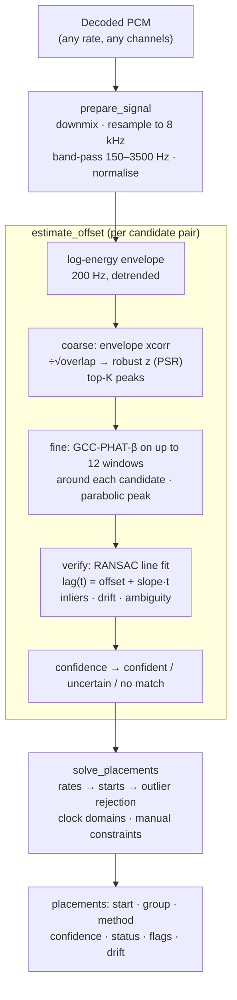

# Synchronisation engine

This document specifies the algorithms in `engine/src/mcsync/sync` (milestone 1). All figures quoted were measured with
the test suite and `engine/scripts/benchmark_sync.py` on a 4-vCPU cloud container, single-threaded.

## 1. Problem and conventions

Given N clips (camera files, recorder files; any of them possibly without audio, timecode or both), find each clip's
position on a common timeline, a confidence for that position, and the reasons behind any doubt.

* **Time** is float64 seconds.
* **Offset** between reference R and target T is `start(T) − start(R)`: the position of T's first sample on R's clock.
  Positive means T started later.
* **Drift** `drift_ppm` is T's clock rate relative to R's. Positive means T's clock runs fast (it records more samples
  per real second).
* **Timeline**: the reference clip's clock defines timeline time. By default the reference is the longest clip with
  audio, usually the external recorder.



## 2. Analysis signal

`prepare_signal(samples, rate)`:

1. **Downmix** to mono (mean of channels). Integer PCM is scaled to [−1, 1).
2. **Resample** to 8 kHz with a polyphase filter (`resample_poly`, exact rational ratio). In the application FFmpeg
   does this during extraction; the engine's resampler serves tests and odd inputs.
3. **Band-pass 150–3500 Hz** (4th-order Butterworth, causal). The low cut removes wind, handling noise and HVAC; the
   high cut removes the octave where camera microphones and recorders differ the most. The filter is causal on purpose:
   every recording gets the same filter, so its phase cancels in the cross-spectrum
   (`H·A·conj(H·B) = |H|²·A·conj(B)`) and cannot bias the offset. A test resamples the same audio from 7 input rates
   (11.025–96 kHz) and finds zero offset within 20 µs.
4. **Level and normalisation.** The in-band RMS level is recorded in dBFS. Below −65 dBFS the clip is `silent`. The
   signal is then scaled to unit RMS.

Why 8 kHz? Alignment information lives in onsets and in speech/music structure below 4 kHz. At 8 kHz a 3-hour recording
is 345 MB as float32, and sub-sample interpolation still resolves about 10 µs, a thousand times finer than one frame
at 60 fps (16.7 ms).

## 3. Coarse search: where could the target be?

Camera microphones 15 m from the source and a lavalier on the speaker's lapel record very different spectra and
reverberation, but their **loudness rises and falls at the same instants**. The coarse stage compares loudness
contours:

* **Envelope:** frame energy over 5 ms hops (200 Hz), then `10·log10(E + floor)` with the floor 40 dB below the mean
  frame energy, so that hiss-filled pauses and clean pauses look alike. A 1 s moving average is subtracted to cancel
  gain changes and automatic-gain-control pumping, and the result is standardised.
* **Correlation:** a single FFT cross-correlation over every lag with at least 3 s of overlap. A 3-hour envelope has
  2.2 M points, so this takes milliseconds.
* **Normalisation:** each lag's correlation is divided by `√overlap`. For unrelated signals, the correlation of
  standardised features grows like `√overlap`, so this gives every lag the same noise spread; partial overlaps are
  neither favoured nor penalised.
* **Peak-to-sidelobe ratio (PSR):** a robust z-score, `(z − median) / (1.4826·MAD)`, computed over all admissible
  lags. When a search window restricts where the peak may be, the null distribution is still estimated from all lags.
* **Band envelope (1.3):** a second contour made for noisy cameras. For 12 bands between 300 and 3500 Hz, each
  band's log energy minus its own 1 s running mean, divided by that band's MAD and clipped to −3…6, averaged over
  the bands. Stationary noise (gimbal motors, wind, hum) is a steady level in its band, so it cancels; speech and
  music onsets stand out in several bands at once. On the gimbal benchmark the true offset's z-score is 5.8 with the
  band envelope against 0.8 with the broadband one. Both contours are searched and their peaks merged.
* **Candidates:** the top `max_candidates + 1` local maxima at least 150 ms apart, from both contours. Candidates from
  PSR 3.5 (`refine_psr`) are refined, as long as they are within 60 % of the best. A match whose best candidate is
  below PSR 5 (`detection_psr`) stands only if the fine stage verifies it (3 or more windows agreeing to the
  millisecond); otherwise it is `no_correlation`.
* **Narrow searches** (a window at most 10 s wide, as predicted by a calibrated clock, see §8.1) hold too few lags
  for a meaningful PSR: their best candidates go to the fine stage whatever their PSR, and the fine stage decides.

## 4. Fine stage: exactly where?

Each candidate is measured on the waveform in up to 12 windows (10 s each, down to 1 s for short overlaps) spread
evenly over the overlap. Each window:

* The target window is correlated with the reference over `±(30 ms + max_drift·overlap)` around the candidate. The
  drift allowance (100 ppm) keeps a drifting clip's last window inside the search.
* **GCC-PHAT-β:** the cross-spectrum is divided by `|X|^0.8` and zeroed outside the analysis band. Whitening sharpens
  the peak and suppresses reverberation. Full PHAT (β = 1) over-whitens: bins that a microphone's response emptied
  become unit-weight noise. The test suite shows full PHAT is *less* sharp than plain correlation on coloured audio,
  while β = 0.8 is sharper than both.
* **Parabolic interpolation** of the peak gives sub-sample resolution.
* **Waveform correlation** (Pearson ρ) is recorded per window for diagnostics and the UI. It does not enter the
  confidence, because it does not separate true from false matches: a true match at −10 dB SNR in a 2 s reverb has ρ
  near 0.03, as do beat-aligned unrelated songs.
* **Peak prominence (1.3):** each window's GCC-PHAT correlogram is also computed over ±0.25 s, and the peak's
  robust z-score over that span is its prominence. The same sound gives 25–40; rhythmic look-alikes (beat grids,
  footsteps) stay at 10 or below. The match's prominence is the median over its inlier windows.
* Windows quieter than −35 dB relative to the clip are skipped.
* **Progressive verification:** windows are visited in a spread-out order (both ends, middle, quarters…). If fewer than
  3 of the first 4 agree, the candidate is abandoned. True matches agree almost everywhere, so this halves the cost of
  the many pairs that do not overlap at all, without changing any result in the test suite.

## 5. Verification and drift

The per-window lags are fitted with `lag(t) = offset + slope·t` (t = target time):

1. **Exhaustive RANSAC** (n ≤ 12). Every window serves as a constant hypothesis and every pair of windows as a line
   hypothesis with slope within ±100 ppm. The hypothesis with the most inliers wins, where an inlier is within 1 ms of
   the line.
2. **Least-squares refit** on the inliers. The slope is kept only if it exceeds both 3 standard errors and 0.5 ppm
   (1.8 ms/hour). Otherwise the clocks are treated as equal.
3. **Outputs:**
   * `offset_s` at the **overlap midpoint** `offset_time_s`: the point where the measurement is most precise, and the
     best constant alignment for this pair.
   * `drift_ppm = −slope·10⁶` with its standard error `drift_std_ppm`.
   * The inlier count and fraction.
   * Every window's measurement, for the UI's "match quality over time" view.

The candidate with the most inliers wins. If a runner-up is verified with at least 80 % as many inliers (and at least
3), the match is **ambiguous**. This happens with sample-identical loops, or with the same song played at the ceremony
and again at the reception. Measured: a 40 ppm clock over 20 minutes is recovered as 40.01 ppm, with the midpoint offset
within 5 µs.

## 6. Confidence

```
verification = count(n_inliers) × (0.3 + 0.7 · smoothstep(inlier_fraction, 0.4, 0.9))
               count: 0 → 0, 1 → 0.5, 2 → 0.65, ≥3 → 1
detection    = smoothstep(coarse PSR, 5, 10), or smoothstep(prominence, 15, 30) if higher and ≥ 3 windows agree
overlap      = smoothstep(overlap_s, 3 s, 10 s)
confidence   = verification × (0.7 + 0.3·detection) × (0.8 + 0.2·overlap)
               capped at 0.5 when ambiguous, or when the verified windows correlate below 0.1 (weak_correlation)
               unless their peak prominence shows the same sound (≥ 15)
```

`confident` ≥ 0.7 > `uncertain` ≥ 0.35 > `no_match`.

The formula was calibrated against the failure that matters most: **two unrelated recordings reported as a confident
match**. Findings from calibration:

* Two different songs at the same tempo line up their beat grids in about half of the windows, with coarse PSR up to
  18. An earlier, gentler verification curve rated these up to 0.81 (confident). The current curve caps them at 0.46.
* Across 132 unrelated pairs (speech, music, ambience, mixed; 10–90 s clips; 10 dB SNR), **none is confident**: 126
  are `no_match` and 6 are `uncertain`, the worst scoring 0.46.
* True matches in the test matrix score 1.0, except short overlaps. A 4 s clip scores 0.70 with `short_overlap`; a 6 s
  overlap scores 0.87.
* At production scale (26,388 verified pairs in the 4,230-clip stress production) 17 confident matches were wrong.
  They were music sessions, where beats line up across unrelated moments: every window agreed, but the
  normalised correlation stayed at or below 0.14. Among the 22,294 correct confident matches, 99.9 % correlate at
  0.157 or above. Hence the `weak_correlation` cap: a match whose windows agree but barely correlate is uncertain.

Flags (stable identifiers the UI explains): `silent`, `silent_overlap`, `no_overlap`, `no_correlation`, `ambiguous`,
`inconsistent_windows`, `unverified`, `short_overlap`, `drift`, `clock_mismatch`, `weak_correlation`, and at
placement level `rejected_inconsistent`, `redundant_uncertain`, `uncertain_merge`, `user_rejected`, `below_threshold`,
`conflicting_matches`, `timecode_disagrees`,
`detached_group`, `manual`, `manual_conflict`, `excluded`, `no_audio`.

## 7. Global placement

### 7.1 Model

Clip *i* maps its local time τ onto the timeline as `T_i(τ) = x_i + (1 + r_i)·τ`: `x_i` is where it starts and `r_i`
is its clock-rate error relative to the reference (`r_ref = 0`). Every measurement is an edge between nodes:

| Edge | Constraint | Weight |
|---|---|---|
| Audio match (R→T) at target time t, offset m, slope b | rates: `r_T − r_R = b`; starts: `x_T − x_R = m + r_R·(t + m) − r_T·t` | `1/σ²`, where σ = standard error ÷ confidence (floor 0.5 ms) |
| Clock reading (timecode, BWF, creation time) | `x_clip − x_c = clock_start`, with `c` a virtual node per clock domain | σ: 1 frame (timecode), 20 ms (BWF), 1 s (creation time) |
| Manual offset (user) | exact: `P_clip − P_anchor = offset` on displayed starts | merged by union-find |

The two audio constraints come from equating the timeline position of the same instant (`t` in T, `t + m` in R).
Measuring each pair at its own overlap midpoint and then correcting with **global** rates keeps cycles consistent.
Constant offsets would not: with a camera drifting 12 ppm, correct pairwise offsets disagreed by 24 ms around a cycle,
and a drift-unaware solver rejected a correct match. The long-recording test reproduces this and now passes with no
rejections.

### 7.2 Solve

1. **Rates:** weighted least squares on the audio graph, anchored at the reference (or at the longest clip in
   components without it).
2. **Manual constraints:** applied exactly by a weighted union-find. Contradictory manual edits are reported
   (`manual_conflict`) and the later one is ignored.
3. **Starts:** weighted least squares per connected component, with rate corrections applied.
4. **Outlier rejection:** reject the edge with the largest `|residual| / max(4σ, 5 ms)` above 1, re-solve, and repeat
   until everything is consistent. A wrong edge inside a cycle of correct ones stands out because the correct ones
   agree. Bridges (edges in no cycle) cannot be checked; they are accepted and the clip's confidence reflects the
   single edge. Components are independent, so each round rejects the worst edge of every component at once.

Before solving, uncertain audio edges are reduced to bridges. Strong evidence (confident matches, precise clocks,
manual offsets) forms groups first:

* an uncertain edge inside a group is dropped (`redundant_uncertain`);
* an uncertain edge may attach one device's clips to a group;
* uncertain edges between two groups that each hold several devices are dropped (`uncertain_merge`). Joining whole
  sessions needs a confident match.

The solve runs on arrays: one sparse normal-equations system for all components (SciPy), with connected components
from `scipy.sparse.csgraph`. At 4,230 clips and about 30,000 edges it takes under a second.

### 7.3 Clock domains

A clock domain is a set of clips whose start readings share a clock. Examples:

* all devices jam-synced to one timecode generator share a domain;
* each camera's internal clock is its own domain.

A domain is a node with an unknown offset. This lets an **interrupted clip without usable audio** land correctly: its
camera's clock places it relative to that camera's audio-synced clips, even when the camera clock is set 3 minutes
wrong or to another time zone. Timecode crossing midnight is unwrapped per domain (a span over 12 h means next day).

A device whose consecutive takes are contiguous to within two frames has rec-run timecode, which cannot place takes
relative to each other, so its timecode is not used as a clock. Files that really are one recording split in several
are not evidence of rec run: chapters of one take, files whose creation times also follow each other, and a sound
recorder's Broadcast WAV files (sample-counted time references, split at a size or length limit).

### 7.4 Output

For each clip:

* `start_s`, relative to the reference, or to the longest clip for detached groups;
* `group`: 0 is the main group; ≥1 are groups not connected to the reference;
* `method`: reference, audio, timecode, metadata or manual;
* `confidence`;
* `status`: synced, needs_review or unsynced;
* `flags`;
* `drift_ppm`;
* `corroboration`: how many other devices hold the clip through accepted confident audio matches.

**Result statuses** (`sync.summary`, the Results screen, the inspector; stored in the project's `sync_result` view with
the method, confidence, evidence, drift, manual adjustment, sync points and analysis version):

| Status | When |
|---|---|
| Confirmed | the reference; placed or accepted by the user; or confidence ≥ 95 % with 2 or more other devices agreeing |
| High confidence | confidence ≥ 95 %, one device's evidence |
| Synchronized | confidence at or above the review threshold |
| Review recommended | below the threshold, placed by a camera clock alone, or contradicted by other evidence |
| Manual sync required | nothing places the clip (never guessed) |
| Failed / Skipped | unreadable; excluded or an ignored duplicate |

A recording time alone never makes a clip synchronized: clock placements are always for review.

**Calibrated clocks outweigh uncertain matches (1.3).** Least squares trusts a tight audio edge over a clock edge,
so when a clip's only audio evidence is uncertain (< 0.7) and disagrees with its device's clock, outlier rejection
used to drop the clock and keep the audio, placing a muted gimbal clip 20 minutes away. When the clock domain is
calibrated by three or more confidently matched clips, the uncertain match is rejected instead (`clock_mismatch`)
and the clip is placed by its clock, still for review. A confident match is never overruled by a clock.

`start_s` is the **best constant placement** `x + r·D/2`: an NLE plays each clip at nominal speed from one position,
and this centres the residual drift error (±r·D/2) on the clip. `drift_ppm` allows exact retiming (speed
`1/(1 − drift_ppm·10⁻⁶)`) when export supports it (M6).

A clip is `needs_review` when any of these holds:

* its confidence is < 0.7;
* it is in a detached group and `detached_groups_need_review` is set (off by default: a separate session is placed
  on its own timeline);
* its timecode disagrees with the audio consensus;
* a confident audio match involving it had to be rejected.

Manual placements are final: they are `synced`, and the neighbours whose audio edges the user overrode are not flagged.

## 8. Timecode and hybrid mode

| Mode | Audio | Clocks |
|---|---|---|
| `audio` | all candidate pairs, full search | ignored |
| `timecode` | not analysed | placement from clock edges only (frame-accurate) |
| `hybrid` (default) | pairs in the same clock domain are searched only within ±(2 s + 3σ) of the clock-predicted offset; pairs that clocks prove cannot overlap are skipped | fill gaps (clips without audio, like drones) and flag disagreements |

If nothing confident is found inside the clock window, the full range is searched. A confident result elsewhere is
accepted with `clock_mismatch`, and the solver then rejects the wrong timecode edge (`timecode_disagrees`).
Jam-synced timecode gives frame-accurate positions; audio refines them to sub-frame. In the tests, a clip whose
timecode says 40.000 s is placed at its true 40.013 s.

Timecode arithmetic lives in `mcsync.timecode`:

* exact rational rates (23.976 = 24000/1001);
* drop-frame for 29.97, 59.94 and 119.88, including rejection of labels that do not exist;
* 24 h wrap;
* BWF `time_reference`.

### 8.1 Which pairs to compare

Up to about 25 clips (300 cross-device pairs) every pair is compared. Beyond that, comparing every pair is out of
reach (4,200 clips give 8.8 million pairs), while the pairs that really overlap grow only linearly. Pairs come from
a funnel (`sync/candidates.py`):

1. **Clocks:** pairs whose shared clock predicts an overlap, found by a sweep over time and verified in the
   predicted window.
2. **Landmarks:** spectrogram peak pairs hashed into one inverted index on disk (`sync/landmarks.py`). Each clip's
   hashes vote for time differences against every other clip, and the strongest differences become candidates. The
   full matcher verifies each one in a narrow window around the voted offset (`verify_pair`).
3. **Extended search:** clips still without a confident match get a full-range search against a bounded number of
   likely partners: the clips their votes pointed to, and the longest recordings nearest in recording time.
4. **Clock anchoring (temporal continuity, 1.3):** from the placements so far, each device's clock offset is
   calibrated (median of start − recording time over its confidently matched clips; spread from their MAD). Each
   clip of that device still without a confident match is searched again in a narrow window (±max(1.5 s, 3 × spread)
   plus drift) around where its clock puts it, against up to 3 confidently placed recordings of other devices that
   overlap it (sound recorders first). Short, noisy clips that a full-range search cannot single out are found this
   way; wrong windows produce no verified match (checked by searching deliberately shifted windows).
5. **Manual:** whatever is left is reported for manual sync, never guessed.

In the 4,230-clip stress production the funnel planned 26,388 pairs: 0.3 % of the 8.8 million possible pairs.

## 9. Measured accuracy and speed

| Scenario | Result |
|---|---|
| 48 kHz vs 44.1 kHz recordings, fractional offsets, EQ, −12 dB gain | error ≤ 0.1 ms (typically ~10 µs), confidence ≥ 0.9 |
| 10 randomised conditions (0–30 dB SNR, 0–1.2 s RT60, 80–400 Hz high-pass, −30 dB gain, 8–48 kHz) | all confident, error ≤ 0.5 ms |
| Camera far from source: −5 dB SNR, 1.5 s RT60, reverb 6 dB above direct sound | confident, error ≤ 0.5 ms |
| −10 dB SNR, 2 s RT60, reverb 10 dB above direct sound | not recoverable from the audio; reported `uncertain`, never confident |
| 3 h reference vs 20 min clip with 20 ppm drift | 1.4 s preparation (from 8 kHz PCM) + 0.35 s matching; error 2 µs; drift 20.0 ppm |
| 24 clips around a 1 h recorder (221 pairs) | 13.2 s analysis (60 ms/pair, one core); 2.4 ms solve; 24/24 synced |
| Engine memory | about 3× the analysis signal at peak (330 MB while preparing and matching a 1 h recording) |

### 9.1 Multicamera benchmark (`python -m mcsync.testing.multicam`)

A wedding cut from one rendered scene, so every offset is known: a sound recorder (2 × 20 min), a lavalier, a main
camera from the back of the room (reverberant), a gimbal camera with 60 short clips whose microphone mostly hears
motors and wind, a quiet camera (−30 dB) and a phone with one clip without sound (85 files). The **hard** scenario
makes the gimbal worse: 5–25 s clips, motors and wind 12 dB above the room, reverberant, and one clip in five muted.
Measured on 4 cores (false match: reported synchronized or high confidence but more than a frame wrong):

| Scenario | Version | Gimbal: synced / review / manual | All 85: auto-synced | False matches | Worst placement |
|---|---|---|---|---|---|
| standard | 1.2 | 54 / 6 / 0 | 78 | 0 | 0.32 s (clock only, review) |
| standard | 1.3 | 60 / 0 / 0 | 84 | 0 | 0.32 s (clock only, review) |
| hard | 1.2 | 0 / 0 / 60 | 24 | 0 | — (60 clips unplaced) |
| hard | 1.3 | 43 / 17 / 0 | 67 | 0 | 0.50 s (clock only, review) |

In the hard scenario, the 17 gimbal clips left for review are the 12 muted clips (placed by the calibrated camera
clock, within 0.5 s), 2 clips whose sound the matcher cannot single out (clock, within 0.5 s) and 3 exact audio
matches whose confidence stays below the threshold (short overlaps). Sync time rose from 32 s to 55 s for the
anchoring searches.

## 10. Known limitations and planned work

* **Identical audio at two times** (the same song played twice, loops) is flagged `ambiguous`, never guessed. Clock
  metadata (hybrid mode) or a manual pick among the listed alternatives resolves it.
* **Acoustic propagation delay:** sound travels 34 cm per ms. A camera 10 m from the speaker hears them 29 ms after a
  lavalier does, so aligning its audio shifts its picture 29 ms early. This is below one frame at 25/30 fps and is
  usually acceptable. Optional distance compensation is post-v1.
* **Drift is assumed linear** over a clip. That holds for crystal clocks at constant temperature. Variable-frame-rate
  phone footage can also have irregular audio timing; it is detected at import (M2) and flagged.
* **Export quantisation:** xmeml positions are whole sequence frames, so up to ½ frame of rounding. Sub-frame audio
  placement needs FCPXML (M5).
* **Scale:** pairs are matched in a warm process pool (M3): 3.4× on 4 cores. Matching holds the GIL, so threads gave
  1.05×. Workers use single-threaded maths libraries; letting each open its own thread pool made parallel runs 3×
  *slower* than serial. Signals are memory-mapped from the cache (M2) and reach workers as file paths. Incremental
  runs match only new pairs. Caching reference spectra across pairs is a possible further gain.

## 11. Parameter reference

Defaults live in `sync/params.py` (`SyncParams`, `SolverParams`). Each is documented there. The most consequential:

| Parameter | Default | Effect |
|---|---|---|
| `analysis_rate` | 8000 Hz | Precision/memory trade-off. |
| `band_low_hz`, `band_high_hz` | 150, 3500 Hz | Analysis band. |
| `feature_rate` | 200 Hz | Coarse resolution (5 ms). |
| `min_overlap_s` | 3 s | Shortest overlap that can be matched. |
| `detection_psr` | 5 | Clear coarse detection; below it the fine stage must verify. |
| `refine_psr` | 3.5 | Weakest coarse candidate refined (narrow searches: all). |
| `band_env_low_hz`, `band_env_high_hz`, `band_env_bands` | 300, 3500 Hz, 12 | Band envelope for noisy cameras. |
| `same_sound_prominence` | 15 | Peak prominence that shows the same sound. |
| `fine_window_s` / `max_fine_windows` | 10 s / 12 | Verification strength vs cost. |
| `phat_beta` | 0.8 | Whitening strength. |
| `inlier_tolerance_s` | 1 ms | Window agreement tolerance. |
| `max_drift_ppm` | 100 | Largest clock drift tracked. |
| `confident_threshold` / `uncertain_threshold` | 0.7 / 0.35 | Status classes. |
| `outlier_sigma` / `outlier_min_s` | 4 / 5 ms | Solver outlier rejection. |
